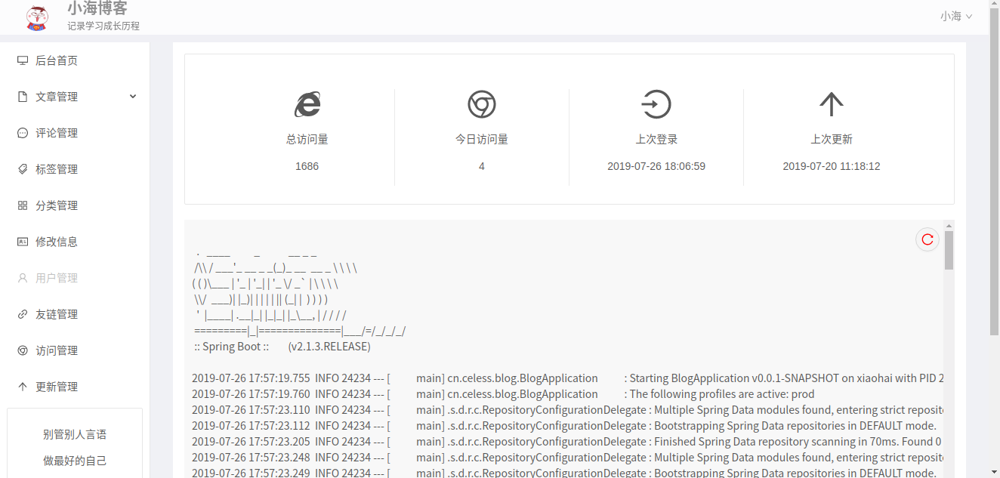
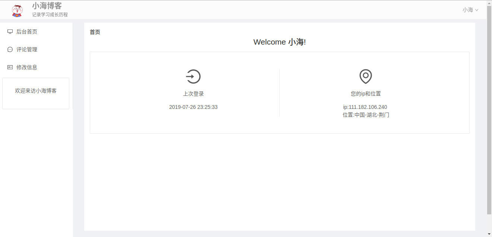
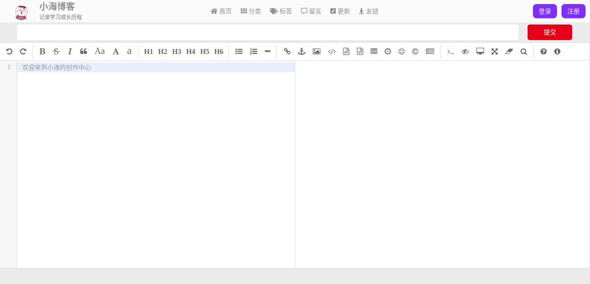

# 前言
**问什么想要写这样的一个博客**

- 原有的WordPress无法为我的Android开发提供全面的接口，自定义程度较低。
- 已学Java，正在接触web开发，期望有项目可以练手。
- 喜欢用自己的东西，不太喜欢抄袭和复用别人的项目。
- 记录我遇到的难题。
- 对技术的热爱&闲

很早之前就再接触博客，而自己的兴趣也比较广泛，很多方面的东西都有接触，当然网站也是很早就接触过了，也对网站有很多的执念，他不需要像Android软件那样需要安装才能使用，不需要像小程序那样只限定在某一个软件里面才能打开，也不需要像windows/linux那样限制在某一个平台。对于一个网站，只有设备有网络，有浏览器就可访问你的网站。而且对于你的网站，你的更新可以不受用户的限制，不需要用户操作就可更新迭代，这全部由开发者自己决定。当然网站还有最重要的一点，就是可定制性高，需要什么功能自己实现即可。

**于是，我决定自己动手写一个博客。**


# 手写一个博客你能学到什么
- Springboot 
- Spring data Jpa / Mybatis 
- redis
- shiro
- mysql
- Maven
- angular

以此来作为一个springboot的入门级项目也是不错的，边敲代码边学习。能够学习到不少的东西，但是用到的这些东西并不是该项技术的全部，望周知。
如果你有springboot的项目经验，以此来串联起各个方面的知识也是不错的。
# 需求
## 前台展示页面
1. 首页展示文章，标签，以及简单的个人信息
2. 有标签和分类的单独页面。
3. 有用户系统
4. 用户可以进行留言和评论。
5. 网站的更新记录
## 后台展示页面
1. 文章管理
2. 文章撰写（Markdown格式）
3. 标签，分类管理
4. 留言，评论管理
5. 友链，网站更新记录的管理
6. 用户管理
7. 访客详情
## 部署
**前后端分离部署**

 **前端** ：nginx 静态部署
 **后端**：java - jar xxx & 后台运行任务

# 设计
后端用到的技术

| 技术         | 名称          | 版本          |
| ------------ | ------------- | ------------- |
| 项目框架     | Springboot    | 2.1.3.RELEASE |
| orm          | mybatis       | 2.0.1         |
| 分页         | PageHelper    | 1.2.12        |
| 缓存         | redis         | 3.0.6         |
| 项目构建     | maven         | 3.6.1         |
| 权限管理框架 | shiro         | 1.3.2         |
| 数据库       | mysql         | 5.7           |
| 数据库连接池 | alibaba druid | 1.1.14        |
| 开发环境     | IDEA          |               |
| 运行环境     | Ubuntu        | 16.04         |
| 图床         | 七牛云        |               |


前端用到的技术

| 技术         | 名称                   |
| ------------ | ---------------------- |
| 项目框架     | angular 8.0            |
| markdown解析 | <span>Editor.md</span> |
| ui库         | Ant Design             |


## 数据库
```mysql
CREATE DATABASE `blog`;

USE blog;

CREATE TABLE `article`
(
    `a_id`             bigint(20) primary key auto_increment,
    `a_title`          varchar(255) not null comment '文章标题',
    `a_summary`        varchar(255) not null comment '文章摘要',
    `a_md_content`     longtext     not null comment '文章Markdown内容',
    `a_tags_id`        varchar(255) not null comment '标签id \',\'处于最尾端',
    `a_category_id`    bigint(20)   not null comment '分类的id',
    `a_url`            tinytext   default null comment '转载文章的原文链接',
    `a_author_id`      bigint(20)   not null comment '作者id',
    `a_is_open`        boolean    default true comment '文章是否可见',
    `a_is_original`    boolean    default true comment '文章是否原创',
    `next_a_id`        bigint(20) default -1 comment '下篇文章id',
    `pre_a_id`         bigint(20) default -1 comment '前一篇文章的id',
    `a_reading_number` int        default 0 comment '文章阅读数',
    `a_publish_date`   datetime     not null comment '文章发布时间',
    `a_update_date`    datetime   default null comment '文章的更新时间'
) comment '文章表';

CREATE TABLE `tag`
(
    `tag_id`   bigint(20) primary key auto_increment,
    `tag_name` varchar(255) not null,
    `articles` tinytext default null comment 'tag对应的文章id'
) comment '标签表';

CREATE table `category`
(
    `c_id`     bigint(20) primary key auto_increment,
    `c_name`   varchar(255) not null,
    `articles` varchar(255) comment '分类下的文章'
) comment '分类表';

CREATE TABLE `comment`
(
    `co_id`          bigint(20) primary key auto_increment,
    `co_article_id`  bigint(20)          default -1 comment '文章id',
    `is_comment`     boolean             default true comment '是否是评论',
    `author_id`      bigint(20) not null comment '留言者id',
    `co_content`     text       not null comment '评论/留言内容',
    `co_date`        datetime   not null comment '评论/留言的日期',
    `co_pid`         bigint     not null default -1 comment '评论/留言的父id',
    `co_response_id` tinytext
) comment '评论/留言表';

CREATE TABLE `links`
(
    `site_id`   bigint(20) primary key auto_increment,
    `site_name` varchar(255) not null comment '友站名称',
    `is_open`   boolean default true comment '是否公开',
    `site_url`  varchar(255) not null comment '首页地址'
) comment '友站表';

CREATE TABLE `visitor`
(
    `v_id`         bigint(20) primary key auto_increment,
    `v_date`       datetime     not null comment '访问时间',
    `v_ip`         varchar(255) not null comment '访客ip',
    `v_user_agent` text comment '访客ua'
) comment '访客表';


CREATE TABLE IF NOT EXISTS `web_update`
(
    `update_id`   bigint(20) primary key auto_increment,
    `update_info` varchar(255) not null comment '更新内容',
    `update_time` datetime     not null comment '更新时间'
) comment '更新内容表';

create table `user`
(
    `u_id`                 int         not null primary key auto_increment,
    `u_email`              varchar(50) not null,
    `u_uid`                varchar(40)          default null comment '用户唯一标识码',
    `u_pwd`                varchar(40) not null comment '密码',
    `email_status`         boolean              default false comment '邮箱验证状态',
    `u_avatar`             varchar(255) comment '用户头像',
    `u_desc`               tinytext comment '用户的描述',
    `recently_landed_time` datetime comment '最近的登录时间',
    `email_verify_id`      varchar(40) comment '用于找回密码或验证邮箱的id',
    `display_name`         varchar(30) comment '展示的昵称',
    `role`                 varchar(40) not null default 'user' comment '权限组',
    unique key `uni_user_id` (`u_id`),
    unique key `uni_user_uid` (`u_uid`),
    unique key `uni_user_email` (`u_email`)
) comment '用户表';
```
## 前端界面
> 首页


> 文章页


##### 后台页面

> 后台首页



> 普通用户后台



> 写作页面



# 总结

开发这个博客我走的路算是比较曲折，多次重构、前端页面多次更换框架、前后端的整合多次调整。如今才算是勉强稳定下来。
我深知这个博客还有很多不足，代码也还有很多不规范的地方，我也会不断的修改，不断的完善

本人博客：[https://www.celess.cn](https://www.celess.cn)

欢迎star，欢迎讨论
